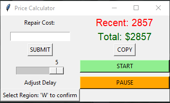

# Albion-Price-Calculator

  

  

  If you are setting up a new region, you must include the tax like shown above. (Default region)

***For Developers only***
Dependencies:

You need to also download googles tesseract-ocr here: https://github.com/UB-Mannheim/tesseract/wiki

Tesseract OCR: pip install pytesseract
https://pypi.org/project/pytesseract/

Needed for selecting the region:

OpenCV: pip install opencv-python
https://pypi.org/project/opencv-python/

mss: pip install mss
https://pypi.org/project/mss/

pyinput: pip install pynput
https://pypi.org/project/pynput/

